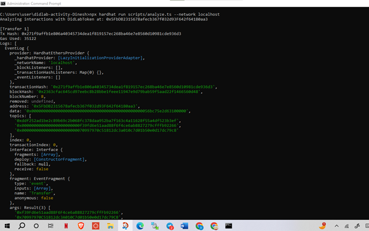

# Assignment 2 — Analyze Transactions with Hardhat

## Part A — Deployment

- **Contract**: DidLabToken (ERC-20)
- **Symbol**: DLAB
- **Decimals**: 18
- **Initial Supply**: 1,000,000 DLAB (raw: 1000000000000000000000000)
- **Compiler Version**: 0.8.24
- **Deployment Script**: `scripts/deploy.ts`
- **Deployed Address**: `0x5FbDB2315678afecb367f032d93F642f64180aa3`
- **Deployer Address**: `0x9f39Fd6e51aad88f6F4c6aB8827279cFffB92266`

  

---

## Part B — Transaction Details

### Tx1 (Transfer 100 DLAB)
- **Status**: Success  
- **Block Number**: 8  
- **From**: `0x9f39Fd6e51aad88f6F4c6aB8827279cFffB92266` (EOA)  
- **To**: `0x5FbDB2315678afecb367f032d93F642f64180aa3` (Contract)  
- **Nonce**: 0  
- **Gas Limit**: 3000000  
- **Gas Used**: 35122  
- **Tx Hash**: `0x271f99f...de936d3`  
- **Events**:  
  - `Transfer(from=0x9f39Fd6e..., to=0x70997970..., value=100000000000000000000)`  
  - Human: 100 DLAB  

---

### Tx2 (Transfer 50 DLAB, higher tip)
- **Status**: Success  
- **Block Number**: 9  
- **From**: `0x70997970C51812dc3A010C7d01b50e0d17dc79C8` (EOA)  
- **To**: `0x5FbDB2315678afecb367f032d93F642f64180aa3` (Contract)  
- **Nonce**: 0  
- **Gas Limit**: 3000000  
- **Gas Used**: 35110  
- **Tx Hash**: `0xfff8d8063...86547427`  
- **Events**:  
  - `Transfer(from=0x70997970..., to=0x3C44CdDd..., value=50000000000000000000)`  
  - Human: 50 DLAB  

---

### Tx3 (Approval of 200 DLAB)
- **Status**: Success  
- **Block Number**: 10  
- **From**: `0x9f39Fd6e51aad88f6F4c6aB8827279cFffB92266` (EOA)  
- **To**: `0x5FbDB2315678afecb367f032d93F642f64180aa3` (Contract)  
- **Nonce**: 1  
- **Gas Limit**: 3000000  
- **Gas Used**: 27064  
- **Tx Hash**: `0xde266ae1...80462e95f`  
- **Events**:  
  - `Approval(owner=0x9f39Fd6e..., spender=0x70997970..., value=200000000000000000000)`  
  - Human: 200 DLAB  

---

## Part C — Fee Comparison (Tx1 vs Tx2)

- **Which landed first**: Tx1 (lower tip, block #8)  
- **Which had higher effective gas price / priority tip**: Tx2 (3 gwei vs 1 gwei for Tx1)  
- **Why**: EIP-1559 prioritizes transactions by **effective gas price**. Tx2 included a higher priority fee (tip), so it was mined quickly despite being sent after Tx1.  

_Explanation_:  
EIP-1559 splits fees into:
- **Base Fee** (burned, same for all txs in block).  
- **Priority Fee (tip)** (extra paid to block proposer).  
- Effective gas price = base fee + tip. Higher tips → higher priority.  

  
  

---

## Part D — Decimals & Conversion

- Example from Tx1:  
  - Raw value: `100000000000000000000`  
  - Human: `100 DLAB` (divide by `1e18`).  

---

## Part E — Screenshots

- ✅ Deployment (contract deployed at `0x5FbDB231...`)  
- ✅ Interact (2 transfers + 1 approval executed)  
- ✅ Analyze (logs for Tx1, Tx2, Tx3 with gas + events)  
- ✅ IPFS (CID + fetch)  
- ✅ MetaMask (custom network DIDLab Team 12 with account + activity)  

---

## Part F — IPFS (Optional)

- **CID**: `QmebweYfV2oQau2De2Mp1viHHQLQf1Gw6ocD7pciA6R3A`  
- **Gateway URL**:  
  [https://gateway.didlab.org/ipfs/QmebweYfV2oQau2De2Mp1viHHQLQf1Gw6ocD7pciA6R3A](https://gateway.didlab.org/ipfs/QmebweYfV2oQau2De2Mp1viHHQLQf1Gw6ocD7pciA6R3A)  
- **Content Retrieved**: _Hello DidLab from Team 12 🚀_  

  

---

## Part G — MetaMask (Optional)

- **Network Name**: DIDLab Team 12  
- **RPC URL**: `https://hh-12.didlab.org`  
- **Chain ID**: 31348  
- **Currency Symbol**: ETH  
- **Imported Account**: Faucet key from Team 12 set  
- **Result**: Balance visible + DIDLab transactions shown in Activity tab  

  

---
